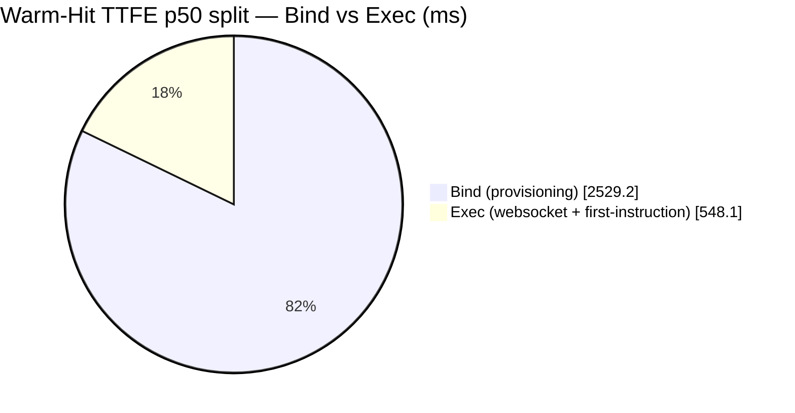

# Honest benchmarks — deep-dive appendix

The corroboration and decomposition tables behind the headline page
([README.md](README.md)) — plus the plain-English **What this means for you** guidance
on picking a runtime and sizing a warm pool. Same rule: **every number is machine-rendered
from a real harness run — nothing here is typed by hand.** Start with the headline page;
come here when you want the guidance or to see the working.

## Known anomalies

### Scenario FAIL

> ⚠️ **Scenario FAIL:** the warm-pool-hit scenario's own outcome is **FAIL** for **gVisor** — the p95 above is a real measurement that MISSED its SLA, not a passing warm hit. It is still graded against the bar and carried forward as the refresh baseline honestly (an SLA-failing number is disclosed, never softened into a green cell); a later refresh whose scenario returns to PASS clears this.

### Warm-slower-than-cold

> ⚠️ **Warm-slower-than-cold:** the warm-pool-hit path is SLOWER than the unique-image cold-start path for **gVisor** (warm count=30, cold count=30): bind warm 4.1631s > cold 3.6649s, TTFE warm 4.7347s > cold 4.1499s — a backwards result (warm is meant to be the fast path). Both rows clear the N=30 comparability floor, so this is not a small-sample inversion. The per-leg breakdown localizes it: the **bind** leg (pod-bind latency) is where warm-pool under-delivery shows up — a real warm hit binds an already-running pod ~instantly, so an inverted bind p95 means the warm population is blended with genuinely-cold claims; the **TTFE** leg is total latency (bind + exec), so a TTFE-only inversion with a clean bind leg points instead at the exec phase, not the pool. The cause is not asserted here (candidates: the warm fire not gating on pool-Ready before probing, a silent image-pull on the warm hit, or a real tail regression); a later refresh whose warm legs return below cold clears this.

### Warm-cold separation below gate

> ⚠️ **Warm/cold separation below gate:** the warm-pool separation ratio (fastest cold start ÷ slowest warm-pool hit) is below the 1.8x gate for **gVisor** (warm count=30): 0.969x (slowest warm bind 4.24564s vs fastest cold bind 1.8371s); **Kata + microVM** (warm count=30): 0.661x (slowest warm bind 1.97997s vs fastest cold bind 1.30837s) — at ~1x the warm and cold populations overlap, so the published warm tier is not demonstrably faster than a unique-image cold start. The warm row clears the N=30 floor, so this is not a small-sample artifact. The cause is a supply-constrained pool draining under load, not cold-claim contamination (hb#450's provenance gate already excludes blends from the counted warm hits): **gVisor** min readyReplicas=5 during the burst; **Kata + microVM** min readyReplicas=0 during the burst — remaining warm-tier binds queue behind the drain rather than being served pre-warmed. A later refresh whose ratio returns to the gate clears this.

### Same-build separation-ratio variance

> ⚠️ **Same-build separation-ratio variance:** the warm-pool separation ratio measured on the SAME controller build swings by 2x or more across independent fires for `sha256:f511a1ab3350…` (2 measurements): 0.272x – 1.06x (3.9x spread) — a byte-identical build should measure consistently, so this large a swing points at instability in the measurement (pool warm-up timing, node contention, or similar), not the build itself. The cause is not asserted here. A single-fire snapshot cannot show this: it is visible only because every fire's ratio is retained in warmpool-separation-history.jsonl rather than the latest fire overwriting the prior one. This entry persists for as long as the flagged digest's history rows do, even after a later build supersedes it in latest.json.

### Single-fire separation verdict defensibility

> ⚠️ **Single-fire separation verdict withheld:** the raw gate issues a pass/fail from ONE fire's separation ratio, but reconciling that ratio against the run-to-run noise floor measured across the accrued same-build history shows the noise band is wider than the ratio's margin to the 1.8x gate, so no single-fire verdict is defensible: **gVisor** — one fire measured 0.969x; at the measured noise floor (σ(log)=0.96, 95% band 0.147x–6.39x) the interval straddles the 1.8x gate, so this single fire cannot tell a real pass from an unlucky draw — 10 consistent fires would resolve this margin. **Kata + microVM** — one fire measured 0.661x; at the measured noise floor (σ(log)=0.96, 95% band 0.1x–4.36x) the interval straddles the 1.8x gate, so this single fire cannot tell a real pass from an unlucky draw — 4 consistent fires would resolve this margin. The verdict layer refuses to issue one and states the fires required instead (fail-closed: it withholds the pass/fail rather than emitting the raw single-fire one it cannot defend). See [WARMPOOL_SEPARATION_VERDICT_PROTOCOL.md](WARMPOOL_SEPARATION_VERDICT_PROTOCOL.md). A refresh with enough consistent fires to clear the noise band resolves this.

### Adjudicated separation verdict (median-of-N)

The published separation verdict adjudicates over the **median of the most recent >=3 accrued fires** per substrate, not a single fire — a single Cloud Build draw is noise-dominated at the 1.8x bar and must not flip the verdict. A side (PASS/FAIL) is issued only when the noise-band interval clears the gate; otherwise the verdict is **HELD** (no flip) and states the fires needed to resolve it. **gke-sandbox** — **HELD** (no flip): median-of-5 = 1.06x, but at the measured noise floor (σ(log)=0.96, 95% band 0.456x–2.46x) the interval straddles the 1.8x gate, so the median does not resolve which side of the gate the build is on — 13 consistent fires would resolve this margin. The prior conservative posture is retained rather than flipping on an unresolved margin. See [WARMPOOL_SEPARATION_VERDICT_PROTOCOL.md](WARMPOOL_SEPARATION_VERDICT_PROTOCOL.md).

### Mixed rig within this run

> ⚠️ **Mixed rig within this run:** this run's sections were not all measured on the same machine class — `e2-standard-16` (at-scale contention, concurrent burst); `n2-standard-16` (top-level provenance, cluster saturation, warm-pool acquisition). Cross-section comparisons on this page may reflect hardware differences, not workload differences, until every section re-measures on one rig.

### Regime note

> ℹ️ **Regime note:** every CI-measured refresh since **2026-07-20** measures a brand-new, single-node ephemeral CI cluster with an empty containerd cache per run — a deliberately cold pull (see "Reproduce it" below). Numbers published **before 2026-07-20** (e.g. the 2026-07-04 baseline) were instead measured on a long-lived, pre-warmed internal cluster, not by this repo's own CI. If you're comparing today's cold-start figures against an older citation of this page and see a large jump, that's this regime switch — not a code or controller regression. ("CI-measured" means *machine-measured on a cold ephemeral cluster*, **not** *scheduled* — see the refresh cadence below.)

### Refresh cadence

> ℹ️ **Refresh cadence (on-demand, not scheduled):** refreshes are **manually invoked / on-demand** — a hand-run CI fire (`gcloud builds triggers run` / the reproduce script below), never a recurring cron. To keep "is this stale?" a decidable question without standing up recurring billed infra, a refresh is **due** when either (a) a **regime boundary** occurs — cluster recreate, node-image float, or controller-build digest change (all caught by the sandbox accrual detectors) — or (b) a **30-day floor** elapses since the last fire (the `_generated-at:_` stamp under the Core Metrics table). Between those, the published numbers are current, not stale.

### Concurrent-burst measurement regime

Per-fire measurement-regime disclosures for the concurrent-burst sweep render inline in [README.md](README.md#does-it-hold-at-cluster-scale) next to each burst — the disclosure can repeat once per date/regime group, so it is not summarized here.

```
Warm/cold separation ratio — fire-over-fire (gate: 1.8x)

2026-08-16 ded4a8bb ████████ 1.42x (below gate)
2026-08-16 41c8c6bc ████████████████████ 3.75x
2026-08-17 f511a1ab █ 0.27x (below gate)
2026-08-17 f511a1ab ██████ 1.06x (below gate)
2026-08-22 1c884bd5 █████ 0.97x (below gate)
```

## Burst Create — TTFE Corroboration

The headline burst count is **pod-Ready** — but a pod can report Ready before it can run your code. TTFE is the stronger claim: the sandbox *executed its first instruction and returned a result*. This block corroborates the two; the **gap** is sandboxes that reported Ready but had not yet run code.

| Signal | Count |
|---|---|
| Pod-Ready <1s (weaker claim) | 7 |
| Executed first-instruction <1s (TTFE, stronger claim) | 4 |
| Ready-but-not-yet-run (gap) | 3 |
| Execution success (Honesty Check) | 100% |

_Pod-Ready ≥ executed-TTFE by construction; the gap is the over-claim a pod-Ready headline would hide._

## Warm-Hit TTFE — Bind vs Exec Decomposition

Warm-hit TTFE (create → first-instruction result) splits into **bind** (create → bound, i.e. provisioning the pool member) and **exec** (websocket setup + the first-instruction round-trip). This block shows *where* a warm-hit above the <1s target lives — a large bind points at provisioning (a controller/clone target); a large exec points at the exec channel (a harness/product artifact, not a controller regression).

| Stage | p50 | p95 |
|---|---|---|
| Bind (create → bound, provisioning) | 2.5292s | 4.1631s |
| Exec (websocket + first-instruction) | 0.5481s | 0.7369s |
| **TTFE (total)** | **3.1269s** | **4.7347s** |

_Each row is an independently-measured percentile of its own per-claim distribution (exec is measured per-claim as TTFE − bind, then percentiled — not p50(TTFE) − p50(bind)). Percentiles do not sum, so bind and exec need not add exactly to the total TTFE._



## Cold-Start TTFE — Provision vs Exec Decomposition

Cold-start TTFE (create → first-instruction result) splits into **provision** (create → Ready: controller reconcile + pod schedule + image pull + container start) and **exec** (websocket setup + the first-instruction round-trip on the already-Ready sandbox). For a cold start the provision is *expected* to dominate — a cold image pull is genuinely slow — so the signal to watch here is a large **exec**, which would point at the exec channel (a harness/product artifact), not the cold provision itself.

| Stage | p50 | p95 |
|---|---|---|
| Provision (create → Ready) | 2.8451s | 3.6649s |
| Exec (websocket + first-instruction) | 0.4777s | 0.5432s |
| **TTFE (total)** | **3.3542s** | **4.1499s** |

_Each row is an independently-measured value against the same shared t0 (exec is the measured residual TTFE − provision, not a subtraction of percentiles). For the single-sample cold cell the p50 and p95 are the one measured sample._

## Warm-vs-Cold Speedup

A warm-pool provision is **2.80241× faster** † than a true-cold start (gVisor). The warm pool keeps a ready slot so a claim skips the fresh-node image-pull path a cold start pays in full. Both legs are measured the same way (TTFE (executed first-instruction)); but this ratio rests on only n=10 warm claims — fewer than N=30, too few to rank reliably, so treat it as provisional.

| Leg | TTFE (p50) |
|---|---|
| Warm-pool hit (gVisor, n=10) | 1.1969s |
| True-cold (unique-image) | 3.3542s |
| Speedup (warm is N× faster) | 2.80241× † |

_Speedup = cold ÷ warm, computed from the displayed values over n=10 warm claims; both legs are medians (p50) — the warm leg over its warm-pool claims and the cold leg over the true-cold distribution — so half of warm claims and half of cold starts run slower than the values shown._

_† The warm leg's p50 is drawn from only n=10 claims — fewer than the N=30 sample floor the page uses across its cross-sample rankings (matrix p95 cells, build-over-build trend Δ); the speedup may be sampling noise, not a stable ratio you can reproduce._

_This warm-vs-cold pair is a standalone point-in-time run; its warm-pool leg is a separate measurement from the Core Metrics matrix "Warm-pool hit" row (an independent run at its own operating point, refreshed on its own cadence). Read each block on its own terms — the two warm p50s are not directly comparable._

_Measured 2026-08-22 — warm-vs-cold speedup (point-in-time; refreshed on the next TTFE fire)._

## Kata + microVM Activation (pod-Ready — NOT TTFE)

These are **Kata + microVM pod-Ready / microVM-activation** latencies — the time to bring the guest microVM up and the pod Ready. They are **not TTFE** (the Core Metrics matrix's executed-first-instruction-and-returned-a-result metric), so they are **not comparable to the matrix TTFE columns**. For the Kata TTFE itself, read the matrix TTFE cells: they report it where a TTFE probe has run under Kata, and `pending` where one has not. Measured on hypervisor **Cloud Hypervisor**, Kata **3.32.0**, guest kernel `6.18.35`, host kernel `6.8.0-1054-gke`, n=3.

| Phase | Pod-Ready latency |
|---|---|
| microVM activation | 2s |
| Warm-pool hit (ubuntu:24.04) | 3s |
| Cold start — debian:12 (image pull 0.9s) | 3s |
| Cold start — ubuntu:24.04 (image pull 0.887s) | 5s |
| Snapshot resume | [N/A — CRIU checkpoint/restore does not transfer to the Kata VM model](WORK_IN_PROGRESS.md#na-by-construction) |

_Measured 2026-06-30 — Kata pod-Ready / microVM-activation (point-in-time; not TTFE)._

## Warm-Pool Acquisition — how fast the pool hands you a sandbox

Acquisition latency on **gVisor**: the time from a `SandboxClaim` being **requested** to it being **bound** — a warm, ready sandbox handed back to the caller. This is a **decomposed sub-phase of TTFE**, not the whole thing: it stops at the moment you hold a ready sandbox and **excludes** the exec-attach + first-instruction round-trip the Concurrent Burst and Core Metrics tables measure — so these numbers are **not comparable** to those TTFE columns. It is the earlier, isolated question a warm-pool operator sizes against: *once my pool is warm, how quickly do I get a sandbox?* Measured under a sustained **300 claims/sec** offered load against a warm pool of **600**. Cluster shape: `n2-standard-16`.

| Sample (n) | Acquisition p50 | Acquisition p95 | Acquisition p99 |
|---|---|---|---|
| 600 | 2.93965s | 3.87844s | 4.00962s |

_Controller-startup lower bound (p95 **1.33812s**): controller-first-observed → Ready, which EXCLUDES the claim-admission → first-reconcile queueing lag — it UNDER-reports the true acquisition path, so treat it as a floor on the controller's own contribution, not a second acquisition measurement._

_Measured 2026-07-01 — warm-pool acquisition latency (point-in-time)._

## How to read the Core Metrics cells

- **TTFE** — Time-To-First-Instruction: wall-clock from asking for a sandbox until your agent's first instruction has run and returned a result — not merely pod-Ready.
- **p50 / p95** — median / worst-in-20; plan UX around p95. Read TTFE *down* a column, not across rows — activation-mode rows differ in sample size by orders of magnitude (each cell shows its own `(count=N)`), so only rows with similar N are comparable.
- **Warm-pool hit vs. Unique-image cold (RL reality)** — a warm-pool hit is served from a pre-started idle pool (startup already paid); the unique-image-cold row is a fresh sandbox on a never-pulled image — image pull + cold start on the critical path, the worst case a reinforcement-learning training loop actually hits.
- **Throughput `x /node · y /cluster`** — per-node is the engineering rate (comparable across runtimes); per-cluster is a MEASURED per-activation-mode rate at the node count named in the bold caption above the table — the per-cluster fire is separate from the per-node fire, so the build line's `node_count` (the per-node fire's shape) does not apply to it — never a per-node × N extrapolation.
- **Why the per-node rate can repeat across the `<5s` and `<1s` columns** — the two throughput columns are SLO-gated: a per-node figure fills a column when the row's TTFE p95 clears THAT column's bar. When p95 clears BOTH bars (p95 < 1s ⇒ p95 < 5s too), the same per-node rate legitimately satisfies both, so it renders identically in both columns — not a copy-paste. The two per-CLUSTER halves can still differ (or carry different caveats) because each bar's cluster figure is credited under its own basis — and may even coincide numerically while resting on DIFFERENT bases (e.g. a literal-TTFE floor at the <5s bar and an acquire-side floor at the <1s bar landing on the same number), distinguished by the per-cell caveat tag (`***U`/`***Z`/`***K` — see below), not by the digits.
- **`≥y /cluster` (certification floor)** — a per-cluster figure prefixed `≥` is a LOWER BOUND on the true sustainable rate, not the rate itself. Two floor constructions carry it, and the `≥` arises for DIFFERENT reasons: **(a) a literal-TTFE-upper-bound basis** — a TTFE ceiling `t` yields a rate floor `≥1/t` by construction (the exec-probe warm p95 is an UPPER bound on TTFE, so the derived rate is a lower bound regardless of the trust gate; this basis is not trust-gate-capped once the controller cross-check corroborates it). **(b) the uncorroborated acquire-side basis (`***U`)** — the highest rung whose acquire p95 cleared the bar, with the controller cross-check dropped; `≥` because upstream #940 double-records warm-path Ready transitions, disqualifying the higher rungs, so the ladder never saturated and a higher real rate exists but is presently uncorroborated. These are NOT the same graduation story. The (b) trust-gate cap is what agent-sandbox#1114 (merged 2026-07-22, the controller double-count fix) clears — but re-measuring against a #1114-bearing controller only restores controller corroboration, moving the cell onto the (a) construction, which STILL renders `≥`. A floor graduates to a *bare* measured rate ONLY under the true-TTFE (webhook-corroborated) basis — a graduated real number rather than a bound — not merely from a gate fix plus a re-fire. A `≥` figure below the cluster sizing target still carries ⚠️ (the floor itself is under target); an uncorroborated floor also carries `***U` (see the caveat block below).
- **honest `0`** — the measurement ran and could not hold the bar: the measured TTFE p95 misses that cell's SLO, so the SLO-compliant throughput is a real `0` (we print it rather than round up) — not "zero activity". A derived `0` inherits the sample basis of the p95 it reads, so a single-sample p95 yields a single-sample `0` carrying †.
- **measured `0` (floor-zero)** — the second zero provenance, distinct from the derived `0` above: here the SLO-rate fire itself RAN and emitted a stamped zero — at the lowest offered rate fired, the majority of samples missed the bar by a pre-declared margin even after granting every unevaluable sample a pass, so no compliant operating point exists at or above the floor. When this basis is in play the italic basis line above the table names it; a derived `0` instead reads off a measured TTFE p95 with no throughput fire behind it.
- **A sub-bar TTFE p95 next to a `0` in that column's throughput** (e.g. the unique-image-cold row's 3.x s p95 under the <5s bar, yet <5s throughput `0`) — not a contradiction: the TTFE p95 is the acquire-side exec-probe (clean here), but the throughput gate is the CONTROLLER cold-start floor, a SEPARATE and higher measurement that exceeds both bars at every rate — so no compliant operating point exists and the rate is a measured `0` (tagged `***Z`; see the cold-start floor zero note in the caveat block below).
- **A per-node rate next to a p95 OVER that column's bar (`x /node‡`)** — the inverse of the case above, and likewise not a contradiction: the per-node figure is a RATE (the fraction of the sample window's activations that cleared the bar), while the row's TTFE p95 is a PERCENTILE (the 95th-worst single sample). The two are different measured quantities, so a nonzero rate can coexist with an over-bar p95 honestly — e.g. most samples clear the bar and a slow tail alone pulls the percentile over it. Tagged `‡` so a reader knows to read this note instead of assuming a render error or a stale figure.
- **†** — measured over fewer than N=30 samples: read it as a single observation, not a distribution; do not rank it against a high-N row.
- **⚠️** — a miss flag: on Execution Success it marks <100% (and prints the succeeded/total fraction); on a per-cluster throughput figure it marks a rate below the cluster sizing target.
- **`pending`** — awaits its TTFE-instrumented run (a genuinely not-yet-run cell).
- **`pending (cluster-fire)`** — the per-node figure is measured, but the per-cluster half awaits a schema-validated per-mode cluster-throughput fire (distinct from the whole-cluster Saturation ceiling in DETAILS, which measures the aggregate ceiling at overload, not these SLO-gated per-mode cells).
- **`N/A`** — `N/A` by construction: Resume-from-suspend × Kata + microVM can never be measured — CRIU checkpoint/restore does not transfer to the Kata VM isolation model — distinct from `pending`, which awaits a run.
- **Why a `pending` is not just printed as `0`** — a blunter display rule would print `0` for any cell that cannot show compliance: an upper-bound latency basis cannot prove a true miss, a failed agreement gate cannot certify a rate in either direction, and a floor rung whose samples are majority-unevaluable cannot establish the negative claim (the floor-zero predicate's evaluability cap). Each such cell graduates — to a measured rate or a floor-zero `0` — the moment its condition clears. (Two now-closed `pending` flavors that used to illustrate this — `trust-gate` and `no-compliant-rung` — are documented in [Resolved (archive)](#resolved-archive) below.)

**Published-with-caveat cells (`***Z` / `***K`)**

A cell tagged `***<letter>` prints the best figure we measured, not an honest-empty `pending`: the measurement exists but carries a bound or a single-source caveat, spelled out below. Each letter names a distinct measurement basis, so a cell's tag alone tells you which caveat below applies — no need to cross-reference by row/column position. The number is real — read it with its caveat. Each class graduates to a clean figure when its upstream fix lands.

- **`***Z` — Cold-start floor zero** (unique-image-cold SLO-rate cells) — a MEASURED zero, not an absence: the controller cold-start floor (~14.7s p50) exceeds BOTH throughput bars at every offered rate (rate-independent), so no compliant operating point exists. The zero is the sandbox cold-start floor, not an acquire-path miss — the acquire-side latency is clean sub-second (~5/s) at every rung. Corroborated by a controller-MEASURED (trusted) rung whose cold p50 is also over both bars, so it is never asserted from the controller-untrusted floor rung alone. Tracked upstream: [agent-sandbox#751](https://github.com/kubernetes-sigs/agent-sandbox/issues/751) (issue, closed) → fix [agent-sandbox#761](https://github.com/kubernetes-sigs/agent-sandbox/pull/761) (PR, merged).
- **`***K` — Unresolved bounds** (`unk.***K`, Kata + microVM unique-image-cold 5s cell) — a measurement was taken, but the true TTFE p95 is bounded in [~2.5s, ~8.4s] at 0.05–0.07/s: the controller-cold proxy (lower bound) does not breach the 5s bar and the literal exec-probe (upper bound) does not clear it, so no claim is supportable either direction. The exec-probe upper bound includes Kata exec websocket setup overhead; the 5s bar sits INSIDE the bracket — no supportable claim either way. Tracked upstream: [agent-sandbox#751](https://github.com/kubernetes-sigs/agent-sandbox/issues/751) (issue, closed) → fix [agent-sandbox#761](https://github.com/kubernetes-sigs/agent-sandbox/pull/761) (PR, merged).

Two more caveat classes (`***U`, `***R`) formerly applied here and have since graduated — see [Resolved (archive)](#resolved-archive) below; a fresh read of this section never needs them.

## Resolved (archive)

The classes below no longer back any live Core Metrics cell — each was resolved by a merged upstream fix and the affected cells graduated to measured numbers. Kept here (not deleted) so an older discussion or result file that still cites one of these names resolves to an explanation instead of a dangling reference — mirrors the equivalent archive section in WORK_IN_PROGRESS.md.

- **`pending (upstream-blocked)`** — formerly gated the gVisor resume cell: the run landed, but an upstream controller gap (the resume path's Suspended condition never cleared on resume) held the SLO-compliant figure. That fix has since merged upstream and a fresh resume probe landed, so the gVisor resume row now carries measured numbers. Tracked upstream: [agent-sandbox#873](https://github.com/kubernetes-sigs/agent-sandbox/issues/873) (issue, closed) → fix [agent-sandbox#1150](https://github.com/kubernetes-sigs/agent-sandbox/pull/1150) (PR, merged).
- **`pending (trust-gate)`** — formerly gated warm-pool per-cluster SLO-rate cells: derivation was refused by the acquire/controller agreement gate (rel-diff tolerance 0.10) because the upstream controller startup-latency histogram double-recorded Ready transitions on stale-informer replays, inflating the controller leg ~1.7–2× on warm-pool-fulfilled paths. Both upstream legs have since merged and a post-fix fire confirmed the agreement gate now passes. Tracked upstream: [agent-sandbox#940](https://github.com/kubernetes-sigs/agent-sandbox/issues/940) (issue, closed) → fix [agent-sandbox#1087](https://github.com/kubernetes-sigs/agent-sandbox/pull/1087) (PR, merged) → fix [agent-sandbox#1114](https://github.com/kubernetes-sigs/agent-sandbox/pull/1114) (PR, merged).
- **`pending (no-compliant-rung)`** — formerly gated cold-start per-cluster SLO-rate cells: the trust gate PASSED, but every measured rung's p95 (on the literal-TTFE upper-bound basis) sat over the cell's SLO bar, and the tighter true-TTFE basis that could shrink the bound had no production writer upstream. That writer has since merged and both formerly-gated cold cells graduated independently. Tracked upstream: [agent-sandbox#751](https://github.com/kubernetes-sigs/agent-sandbox/issues/751) (issue, closed) → fix [agent-sandbox#761](https://github.com/kubernetes-sigs/agent-sandbox/pull/761) (PR, merged).
- **`***U` — Uncorroborated acquire-side rate** (formerly applied to warm-pool-hit SLO-rate cells) — applied while controller corroboration was unavailable: the upstream controller startup-latency histogram double-recorded Ready transitions on stale-informer replays, inflating the controller leg ~1.7–2× on warm-pool-fulfilled paths, so a published rate could only cite the single-source acquire-side leg. Both upstream legs have since merged and a post-fix fire confirmed the histogram-vs-acquire cross-check now PASSES, so the warm-pool cells are no longer single-source-capped. Tracked upstream: [agent-sandbox#940](https://github.com/kubernetes-sigs/agent-sandbox/issues/940) (issue, closed) → fix [agent-sandbox#1087](https://github.com/kubernetes-sigs/agent-sandbox/pull/1087) (PR, merged) → fix [agent-sandbox#1114](https://github.com/kubernetes-sigs/agent-sandbox/pull/1114) (PR, merged).
- **`***R` — Resume probe ceiling** (formerly the two TTFE cells of the Resume-from-suspend × gVisor row) — applied while the resume never completed (the upstream Suspended condition never cleared on resume), so the probe recorded only the wall-clock ceiling it spent waiting and that ceiling printed as a floor (`≥N.Ns`). That upstream fix has since merged and a fresh resume probe landed, so the resume row graduated to a measured completion distribution. Tracked upstream: [agent-sandbox#873](https://github.com/kubernetes-sigs/agent-sandbox/issues/873) (issue, closed) → fix [agent-sandbox#1150](https://github.com/kubernetes-sigs/agent-sandbox/pull/1150) (PR, merged) (see [WORK_IN_PROGRESS.md#upstream-blocked](WORK_IN_PROGRESS.md#upstream-blocked)).

## Max Density (sandboxes per vCPU)

Max Density is sandboxes per node-allocatable sandbox-schedulable vCPU (the per-node denominator), not per total-cluster vCPU. This is the absolute per-vCPU figure — distinct from the linearity check's per-node density-retention series (a ratio across node counts), which uses a different denominator. An unmeasured runtime renders `pending`.

| Runtime | Max Density (sb/vCPU) |
|---|---|
| gVisor | [pending](WORK_IN_PROGRESS.md#not-yet-measured) |
| Kata + microVM | 1.26 |

```
Max Density (sandboxes per vCPU)

Kata + microVM  ████████████████████ 1.26
```

```
Warm-Pool TTFE (ms) — p50 vs p95

gVisor         p50  █████████████ 3.1269s
               p95  ████████████████████ 4.7347s
Kata + microVM p50  ███████ 1.6668s
               p95  █████████ 2.2426s
```

_Cluster shape (gVisor leg): node_count=2, `n2-standard-16` — the swing-flag threshold compares consecutive fires on this chart, so a node-count or machine-class change shows up here first._

## At Scale Under Contention — where sub-second warm activation breaks

The Concurrent Burst legs on the headline page are **1:1** — N ready sandboxes hit with N claims. This is the deliberate **retraction**: the operating point where the pool is **over-subscribed** (more concurrent claims than ready pool members), and warm activation **stops being sub-second**. Measured on **gVisor**: a pool of **30** ready sandboxes hit with **60** simultaneous claims (**2:1 contention**). Every claim still binds, but the over-subscription serializes the bind path — so the "warm hit is <1s" claim from the Core Metrics matrix does **not** hold here. Cluster shape: node_count=1, `e2-standard-16`.

| Pool | Claims | Contention | TTFE p50 | TTFE p95 | Bind p50 | Bind p95 | Execution Success |
|---|---|---|---|---|---|---|---|
| 30 | 60 | 2:1 | 1.6589s | 2.0169s | 1.384s | 1.7001s | 100% |

_Not directly comparable to the 1:1 Concurrent Burst legs: this point ran at node_count=1 with an over-subscribed pool — a distinct operating point. Latency is node-count-independent (so the TTFE columns DO compare to the matrix/burst TTFE), but the per-node throughput axis is omitted here as non-comparable to the node_count=20 bursts._

_Measured 2026-07-01 — warm-pool at-scale contention ceiling (point-in-time)._

> ⚠️ **Stale — no producer since rig change:** this at-scale-contention figure has no daily producer; it is carried forward unchanged from its last fire, measured on `e2-standard-16`. This run measured the rest of the page on `n2-standard-16`. Treat this section as a frozen snapshot from the prior rig, not a live signal for the current one, until a fresh fire republishes it on the current machine class.

## Cluster Saturation — the whole-cluster warm-hand-out ceiling

The Concurrent Burst legs above are small 1:1 warm bursts. This is the **saturation** ceiling: a **1:1 all-warm** fire — a pool of **600** ready sandboxes hit with **600** simultaneous claims (**not** over-subscribed), spread across **40** nodes on **gVisor**. Every claim has a ready warm pool member, yet at this scale the bind path itself saturates — so the whole-cluster warm hand-out rate collapses far below the per-node engineering rate, and the "warm hit is <1s" claim from the Core Metrics matrix does **not** hold here. Cluster shape: `n2-standard-16`.

| Pool | Claims | Nodes | TTFE p50 | TTFE p95 | Throughput @ <5s | Throughput @ <1s | Bind p50 | Bind p95 | Execution Success |
|---|---|---|---|---|---|---|---|---|---|
| 600 | 600 | 40 | 8.6308s | 12.6103s | 0.064 /node · 2.558 /cluster | 0 /node · 0 /cluster | 8.1916s | 12.1372s | 100% |

_Per-cluster throughput MEASURED at **40 nodes** — never a per-node × N extrapolation (that fiction breaks above the controller reconcile ceiling). This is a **1:1 all-warm** operating point (pool == claim, not over-subscribed), distinct from the over-subscribed contention ceiling: the collapse here is the bind path saturating at cluster scale, not pool exhaustion. Latency is node-count-independent (so the TTFE columns DO compare to the matrix/burst TTFE)._

_SLA ceiling: **not met** at this operating point — the honest saturation limit. Execution success confirms every claim still bound and executed; the FAIL is the throughput collapse against the sizing floor, not a correctness failure._

_Measured 2026-07-02 — whole-cluster saturation ceiling (point-in-time)._

## Provisioning Rate Sweep — where warm-pool fill goes reconcile-bound

The warm-pool numbers elsewhere assume the pool is **already Ready**. This block measures the step before that: how fast the pool can be **provisioned** as a function of the **offered reconcile rate** (sandboxes requested per second). At each rate the pool is driven to a target size and we measure whether it reaches Ready **within the warm timeout**. Measured on **gVisor**.

| Offered reconcile rate | Warm-pool target | Ready within timeout |
|---|---|---|
| 100 sb/s | 1500 | ✅ 100% (converged ~301s) |
| 150 sb/s | 2250 | ❌ 42% (timeout 1125s) |
| 200 sb/s | 3000 | ❌ 21% (timeout 1880s) |

**Provisioning converges at ~100 sb/s; over-subscribed beyond ~(100, 150) sb/s** — monotonic degradation past the ceiling is **reconcile-bound** (the controller reconcile path is the ceiling), not node- or quota-bound.

_A distinct axis from the Concurrent Burst (claim:pool ratio) and Step-up (creation-rate TTFE) blocks: this measures provisioning **offered-rate** convergence, a separate regime — not directly comparable to those latency/throughput points._

_Measured 2026-07-01 — warm-pool provisioning rate sweep (point-in-time; refreshed on the next rate sweep)._

## Warm-Pool Turnover — Sustained-Churn Refill Latency

The matrix measures the **claim** side (a warm hit is sub-second). This block measures the **reclaim** side: after a claim is released, how long the controller takes to **replenish** the warm pool under sustained claim/release churn. A slow refill silently demotes later claims from warm to cold — the failure mode a fleet cycling sandboxes continuously actually hits.

| Refill latency | Value |
|---|---|
| Median (p50) (over 5 cycles) | 1.18668s |
| Tail (p90) | 1.34697s |

_Refill latency is measured per-cycle as the wall-clock from a claim release to the warm pool returning to full readiness; the median and tail are percentiles of the completed-cycle distribution._

## Administrative Suspend Latency

Suspend is the cost-lever for reclaiming a sandbox's compute while keeping its identity: an `operatingMode=Suspended` patch releases the backing Pod but preserves the CR, so a later `operatingMode=Running` patch resumes it. This block reports how fast that **administrative** suspend completes — from the patch to the terminal Suspended state (Pod released + the Suspended condition observed).

_Capability note: this is an **administrative** (operator- or user-driven) suspend. Upstream agent-sandbox exposes only the closed `operatingMode` enum (`Running`; `Suspended`) — there is **no idle-timeout, activity-reclaim, or auto-suspend** path, so this latency must not be read as an automatic scale-to-zero._

| Suspend latency | Value |
|---|---|
| Median (p50) | 2.2471s |
| Tail (p90) | 2.2897s |

_Suspend latency is measured per-cycle as the wall-clock from the `operatingMode=Suspended` patch return to the terminal Suspended state; the median and tail are percentiles of the measured suspend distribution._

## What this means for you

The tables above are the raw measurements. If you build *on* sandboxes but do not run the cluster yourself, here is what they mean in practice:

- **⚠️ Measured, but the warm pool did NOT clear its SLA this run: a new sandbox took ~3.1s (~4.7s at the p95).** That figure is real — not fabricated or estimated — but this scenario's own outcome is FAIL, so treat it as a measured miss to budget against rather than a clean steady-state number; a later refresh whose scenario returns to PASS clears this caveat.
- **A warm-pool hit is about 2.8× faster than starting cold (gVisor).** If start-up latency matters to you, the warm pool is the single biggest lever — size it for your steady demand and most claims never pay the cold path. (This ratio is the dedicated warm-vs-cold leg — a separate point-in-time measurement from the Core Metrics matrix rows above, so do not reproduce it by dividing the matrix cells.)
- **Big simultaneous bursts still work — 300 sandboxes asked for at once settled in ~6.9s.** But that is the pool-overflow regime: the wait climbs toward the cold-start number as claims outrun ready slots, so plan the pool around your steady rate, not your worst spike.
- **Rule of thumb for pool size:** start near your typical concurrent demand (≈0.75× of it) and tune from there. This is a planning heuristic, not one of the measured numbers above.
- **Both runtimes are measured — choose by isolation need.** In the measurements above, warm-pool latency is comparable between them; gVisor delivers the higher per-node throughput, while Kata + microVM puts each sandbox in its own VM for hardware-grade isolation. If unsure, start with gVisor and move only the workloads that need a VM boundary to Kata.
- **gVisor suspend/resume is measured — Kata resume is not.** The gVisor resume cells now carry real numbers (the upstream resume-graduation fix merged and a fresh probe landed). Kata resume stays `N/A` by construction (checkpoint-restore does not transfer to the VM model) — treat Kata resume as unavailable.
- **A cell marked `pending` is unmeasured, not bad.** It means that measurement has not run yet (or is blocked upstream) — never that the platform failed it.
