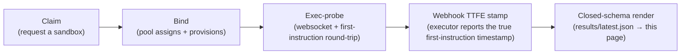

# Honest benchmarks — GKE agent sandbox

**How fast can your agent get a sandbox that has actually run its first instruction?** That is the
only question this page answers. The metric is **TTFE (Time-To-First-Instruction)** — the wall-clock
from "create this sandbox" to "it ran my first instruction and returned a result." Not pod-Ready (a
pod can look ready seconds before it can run your code) — the real wait.

**North Star:** a warm sandbox with **TTFE p95 under 1s** — the bar the caption under the matrix
grades each runtime against (a stricter **0.5s stretch bar** is graded on the same line). The **scale
target** is to hold **sub-1s at 300+ creations/sec**, on a stock GKE cluster you can provision
yourself.

Two runtimes, two isolation trade-offs:
- **gVisor** — a user-space kernel intercepting syscalls; near-container speed, strong isolation.
- **Kata** — each sandbox in its own tiny VM; hardware-grade isolation, higher activation cost.

Every number below is **machine-rendered from a real harness run and reproducible** — no cell is
typed by hand, and each is a **floor, not a ceiling** (what a *vanilla* OSS build delivers today;
a bigger pool or denser nodes should beat it). Reproduce the whole page from a GKE cluster in
three commands (cluster setup — a gVisor/Kata node pool — is in
[`recipe/REPRODUCE.md`](recipe/REPRODUCE.md)):

```bash
bash recipe/install-controller-from-main.sh        # 1. the OSS controller, built from upstream main
python3 -m harness.run                             # 2. run the suite -> sandbox/results/latest.json
python3 -m render.generate && git diff README.md   # 3. re-render this page + diff the result
```

First run `pip install -r harness/requirements.txt`; the gVisor/Kata rows need a matching GKE node
pool — full recipe in [`recipe/REPRODUCE.md`](recipe/REPRODUCE.md), deep-dive tables in
[DETAILS.md](DETAILS.md). Cells shown as *pending* link to
[WORK_IN_PROGRESS.md](WORK_IN_PROGRESS.md) for their reason class; the upstream half of each
blocker — diagnosis plus file-ready patches and comments — is hand-maintained in
[UPSTREAM_BLOCKERS.md](UPSTREAM_BLOCKERS.md).

## Agent Sandbox — Core Metrics

**Throughput is dual — `per-node · per-cluster`.** Per-cluster figures are measured per runtime at DIFFERENT node counts — gVisor at 4 nodes; Kata + microVM at 5 nodes — so they are NOT comparable across runtimes here (different X); see the legend below. (This is a different `node_count` than the one printed in each build's provenance banner below the table — that one describes the per-node fire's shape, not this per-cluster measurement.)

| Runtime | Activation Mode | Throughput @ <5s TTFE (sb/s — node · cluster) | Throughput @ <1s TTFE (sb/s — node · cluster) | TTFE p50 | TTFE p95 | Execution Success (Honesty Check) |
|---|---|---|---|---|---|---|
| gVisor | Warm-pool hit (Base image) ⚠️ FAIL | 0 /node · 9.336 /cluster ⚠️ | 0 /node · 9.336 /cluster ⚠️ | 10.8144s (count=30) | 12.9007s (count=30) | 100% |
| gVisor | Unique-image cold (RL reality) | [pending](WORK_IN_PROGRESS.md#not-yet-measured) | 0 /node · 0 /cluster | 4.0447s (count=200) | 4.9011s (count=200) | 100% |
| gVisor | Resume-from-suspend | 0 /node · 0 /cluster | 0 /node · 0 /cluster | 4.6461s (count=30) | 5.0332s (count=30) | 100% |
| Kata + microVM | Warm-pool hit (Base image) | 14.012 /node · 0.694 /cluster ⚠️ | 0 /node · 0 /cluster | 1.4399s (count=30) | 1.6844s (count=30) | 100% |
| Kata + microVM | Unique-image cold (RL reality) | [pending](WORK_IN_PROGRESS.md#not-yet-measured) | 0 /node · 0 /cluster | 3.1986s (count=30) | 3.5684s (count=30) | 100% |
| Kata + microVM | Resume-from-suspend | [N/A](WORK_IN_PROGRESS.md#na-by-construction) | [N/A](WORK_IN_PROGRESS.md#na-by-construction) | [N/A](WORK_IN_PROGRESS.md#na-by-construction) | [N/A](WORK_IN_PROGRESS.md#na-by-construction) | [N/A](WORK_IN_PROGRESS.md#na-by-construction) |

_⚠️ **Scenario FAIL:** **gVisor** Warm-pool hit (Base image) — the row above carries a real measurement whose own scenario outcome is **FAIL** (SLA not met), not a passing warm hit. The numbers are honest data, disclosed as a miss rather than dropped or greened; a later refresh whose scenario returns to PASS clears this._

### Max Density (sandboxes per vCPU)

Density is per-**runtime** — constant across a runtime's activation-mode rows above, so it renders as a compact per-runtime sub-table here rather than a matrix column (a column would repeat each value down the mode rows and imply a mode-dependence that does not exist). Full methodology (per-vCPU denominator, saturation source) is in [DETAILS.md](DETAILS.md).

| Runtime | Max Density (sb/vCPU) |
|---|---|
| gVisor | 6.23 |
| Kata + microVM | 1.26 |

**Reading the cells** — TTFE is Time-To-First-Instruction (wall-clock until your agent's first instruction returns, not merely pod-Ready). Read TTFE p50/p95 *down* a column, not across rows — activation-mode rows differ in sample size by orders of magnitude.

| Symbol | Meaning |
|---|---|
| `(count=N)` | Sample size for that cell — compare down a column, not across rows |
| `†` | Sub-N sample: a single observation, not a distribution |
| `⚠️` | Miss flag: sub-100% Execution Success, or a per-cluster rate below the sizing target |
| `pending` | No publishable figure yet — a genuinely not-yet-run cell; the labeled flavors (`cluster-fire`, etc.) are catalogued in [WORK_IN_PROGRESS.md](WORK_IN_PROGRESS.md) |
| plain `0` | DERIVED zero: implied by that row's TTFE p95 exceeding the column's bar, no throughput fire behind it — can flip to a real rate on a latency improvement alone |
| caveat-tagged floor-zero | MEASURED zero from an actual throughput fire — needs the cold-start floor itself to move (see the full key) |

Full cell-decoding key — TTFE basis, honest vs. measured zeros, the dual per-node · per-cluster throughput pair, the certification-floor `≥` figures, every `pending` flavor, and the published-with-caveat tag classes — is in [DETAILS.md](DETAILS.md#how-to-read-the-core-metrics-cells).

_Kata + microVM rows are measured in a separate run on the kata node pool: cluster_substrate=gke-kata · node_count=1 · generated-at=2026-08-31T15:22:54Z._

_build: cluster_substrate=gke-sandbox · controller_digest=sha256:822bea7924036d847fcfb6170e1b56da2579af00cb0f8c7e5d0c41e9d1d4a65c · suite_git_sha=88c26c4ab91533f5bf2b1df6611c7abb03236e51 · run_id=f0073b685504454591cb53b308b7ef07 · node_count=2_
_generated-at: 2026-08-28T00:27:02Z_

_**North Star** — warm-pool-hit TTFE p95 < 1s (the spec doc bar): gVisor 12.9007s (count=30) ❌ not met (11.9007s above the bar) ⚠️ **scenario FAIL**; Kata + microVM 1.6844s (count=30) ❌ not met (0.6844s above the bar). An honest ❌ prints the measured gap to the bar (tagged `within sampling noise` when the miss sits inside the sample spread — it stays a ❌, the tag never flips a miss to a pass); `pending` = unmeasured (never a guess); † marks a p95 over fewer than N=30 samples._

_**Stretch bar** — warm-pool-hit TTFE p95 < 0.5s (an aspiration above the North Star, not the North Star itself; the step-up curve grades sustained creation-rate against it — see [DETAILS.md](DETAILS.md)): gVisor 12.9007s (count=30) ❌ not met (12.4007s above the bar) ⚠️ **scenario FAIL**; Kata + microVM 1.6844s (count=30) ❌ not met (1.1844s above the bar)._

### Known anomalies

| Anomaly | Status |
|---|---|
| Scenario FAIL | [⚠️ ACTIVE](DETAILS.md#scenario-fail) |
| Warm-slower-than-cold | [⚠️ ACTIVE](DETAILS.md#warm-slower-than-cold) |
| Warm-cold separation below gate | [⚠️ ACTIVE](DETAILS.md#warm-cold-separation-below-gate) |
| Cold-tier stall inflates separation ratio | [✅ clear](DETAILS.md#cold-tier-stall-inflates-separation-ratio) |
| Same-build separation-ratio variance | [⚠️ ACTIVE](DETAILS.md#same-build-separation-ratio-variance) |
| Single-fire separation verdict defensibility | [⚠️ ACTIVE](DETAILS.md#single-fire-separation-verdict-defensibility) |
| Mixed rig within this run | [⚠️ ACTIVE](DETAILS.md#mixed-rig-within-this-run) |
| Regime note | [ℹ️ standing note](DETAILS.md#regime-note) |
| Refresh cadence | [ℹ️ standing note](DETAILS.md#refresh-cadence) |
| Concurrent-burst measurement regime | [ℹ️ see section](DETAILS.md#concurrent-burst-measurement-regime) |

**What do these numbers mean for you?** Plain-English guidance — picking a runtime, sizing a
warm pool, what wait to budget, and why a `pending` cell is unmeasured-not-bad — is in the
deep-dive appendix, [DETAILS.md](DETAILS.md#what-this-means-for-you).

### What wait should I budget?

Find the row closest to **your** load; the p50 is the wait to plan around. The **Scope** column is load-bearing: the first three rows are the **full** start→first-result wait (TTFE), directly comparable to one another; the last row is only the **pool hand-off** sub-phase (it stops the moment you hold a ready sandbox, before your code runs), so do **not** rank its number against the full-TTFE rows above it. Every number is measured, not modelled — an unmeasured row reads `pending`, never a guess.

| Your load pattern | Wait to budget (p50) | Scope |
|---|---|---|
| Steady trickle — warm pool keeps up with demand ⚠️ FAIL | ~10.8s | full start → first result |
| Bursty — pool oversubscribed 2:1 (60 claims / 30 ready) | ~1.7s | full start → first result |
| 300 sandboxes requested at once (1:1 pool) | ~6.9s | full start → first result |
| Sustained 300/sec churn | ~2.9s | pool hand-off only (before exec) |

_⚠️ **Scenario FAIL:** **Steady trickle — warm pool keeps up with demand** — the row above carries a real measurement whose own scenario outcome is **FAIL** (SLA not met), not a passing warm hit. The wait is honest data, disclosed as a miss rather than dropped or hidden as `pending`; a later refresh whose scenario returns to PASS clears this._

## Does it hold at cluster scale?

Four questions a bigger cluster raises: does throughput stay flat as you add nodes (**linearity**), what does a single all-at-once burst of N claims cost (**concurrency**), where does the whole-cluster warm hand-out rate saturate (**ceiling**), and what happens when the pool is over-subscribed (**contention**)? All below, on the same TTFE spine as the headline matrix.

### Linearity — throughput and density hold flat as nodes grow

| Nodes Tested | Density Holds Flat? | Throughput Holds Flat? |
|---|---|---|
| 1 → 2 | ✅ Yes (1× · 0.63 → 0.63) | ⚠️ No (0.5×) |

_The density values in this row are the per-node density retained at each node count (a linearity series — does per-node density stay flat as the cluster grows?), not the absolute Max Density per vCPU (reported separately in DETAILS)._

_Measured 2026-08-26 — node-count linearity sweep (point-in-time; refreshed on the next multi-node sweep)._

_Node-count 4 requested but not reached (cluster/autoscale ceiling this fire)._

### Concurrent burst — TTFE at N simultaneous claims

Each row is a **single all-at-once burst of N concurrent claims** (not a ramped per-second rate). TTFE is the same metric the Core Metrics matrix reports (executed-first-instruction-and-returned-a-result), so these columns **are comparable to the matrix TTFE columns**. *Warm pool* fires against a pre-provisioned pool of N ready sandboxes; *cold provision* starts from an empty pool (node-autoscaler + image-pull in the critical path). Measured on node_count=20, `e2-standard-16`.

| Concurrency (N) | Activation Mode | TTFE p50 | TTFE p95 | Throughput @ <5s/node | Throughput @ <1s/node | Execution Success |
|---|---|---|---|---|---|---|
| 300 | Warm pool | 6.8743s | 9.393s | 0.392 | 0 | 100% |
| 300 | Cold provision | 56.0294s | 58.4124s | 0 | 0 | 100% |
| 500 | Warm pool | 11.188s | 15.374s | 0.052 | 0 | 100% |
| 500 | Cold provision | 97.3988s | 99.8002s | 0 | 0 | 100% |
| 30 | Warm pool | 2.06969s | 2.9976s | — | — | 100% |
| 30 | Cold provision | 12.3171s | 13.1484s | — | — | 100% |

_Measured 2026-06-30 — concurrent-burst TTFE (point-in-time)._

> ℹ️ **Measurement regime:** this burst ran on a long-lived, **pre-warmed cluster** (warm containerd cache). Fires on or after 2026-07-20 run on cold ephemeral CI clusters and are **not directly comparable** to this baseline.

> ⚠️ **Stale — no producer since rig change:** this concurrent-burst figure has no daily producer; it is carried forward unchanged from its last fire, measured on `e2-standard-16`. This run measured the rest of the page on `n2-standard-16`. Treat this section as a frozen snapshot from the prior rig, not a live signal for the current one, until a fresh fire republishes it on the current machine class.

```
Concurrent Burst — TTFE p50 vs p95 by concurrency (N)

N=30 Warm pool       p50  █ 2.06969s
                     p95  █ 2.9976s
N=30 Cold provision  p50  ██ 12.3171s
                     p95  ███ 13.1484s
N=300 Warm pool      p50  █ 6.8743s
                     p95  ██ 9.393s
N=300 Cold provision p50  ███████████ 56.0294s
                     p95  ████████████ 58.4124s
N=500 Warm pool      p50  ██ 11.188s
                     p95  ███ 15.374s
N=500 Cold provision p50  ████████████████████ 97.3988s
                     p95  ████████████████████ 99.8002s
```

### Saturation — the whole-cluster warm-hand-out ceiling

**Saturation** ceiling — a **1:1 all-warm** fire (**600** ready sandboxes, **600** simultaneous claims, **not** over-subscribed) across **40** nodes on **gVisor**. At this scale the "warm hit is <1s" claim from the Core Metrics matrix does **not** hold here. Cluster shape: `n2-standard-16`.

At **40 nodes** the cluster sustains only **2.558 claims/sec under 5s** (**0/sec under 1s**) across the whole cluster, and TTFE degrades to **8.6308s p50** / **12.6103s p95**. This is the honest per-cluster hand-out ceiling — budget for it when your claim rate can outrun the bind path, not for the sub-second per-node warm hit. Full per-node/per-cluster and bind/exec decomposition is in the deep-dive appendix, [DETAILS.md](DETAILS.md).

_SLA ceiling: **not met** at this operating point — this row is the honest saturation limit, not a warm-hit guarantee. Every claim still bound and executed; the FAIL is the throughput collapse against the sizing floor, not a correctness failure._

_Measured 2026-07-02 — whole-cluster saturation ceiling (point-in-time)._

### Where it breaks — an over-subscribed pool

The deliberate **retraction** — an **over-subscribed** pool (**30** ready sandboxes hit with **60** simultaneous claims, **2:1 contention**) on **gVisor**. Warm activation stops being sub-second: the "warm hit is <1s" claim from the Core Metrics matrix does **not** hold here. Cluster shape: node_count=1, `e2-standard-16`.

Under this contention, TTFE degrades to **1.6589s p50** / **2.0169s p95** — budget for that, not the sub-second warm hit, when your claim rate can outrun your pool. Full bind/exec decomposition is in the deep-dive appendix, [DETAILS.md](DETAILS.md).

_Measured 2026-07-01 — warm-pool at-scale contention ceiling (point-in-time)._

> ⚠️ **Stale — no producer since rig change:** this at-scale-contention figure has no daily producer; it is carried forward unchanged from its last fire, measured on `e2-standard-16`. This run measured the rest of the page on `n2-standard-16`. Treat this section as a frozen snapshot from the prior rig, not a live signal for the current one, until a fresh fire republishes it on the current machine class.

## Throughput — build-over-build

The headline COUNT — sandboxes ready in <1s in a single 1.0s burst against one warm
pool — tracked across distinct controller builds (oldest first). **Δ** is the change in
COUNT vs the prior build; the first build is the baseline. Drive this COUNT up.

| Build (controller digest) | Date | Sandboxes ready <1s | Δ | Density /vCPU (this build) | n | Outcome |
|---|---|---|---|---|---|---|
| `sha256:6edaf7b6b22d…` | 2026-06-28 | 9 | — | 0.45 | 10 | PASS |
| `sha256:4e36a61c6bdc…` | 2026-07-25 | 2 | -7 † | 0.0416667 | 10 | FAIL |
| `sha256:41c8c6bcabe4…` | 2026-08-16 | 10 | +8 † | 0.208333 | 10 | PASS |
| `sha256:1c884bd5d9d7…` | 2026-08-25 | 4 | -6 † | 0.03125 | 10 | FAIL |
| `sha256:cd69601f8fd3…` | 2026-08-25 | 4 | +0 † | 0.0625 | 10 | FAIL |
| `sha256:7606cc6ac7fa…` | 2026-08-26 | 5 | +1 † | 0.078125 | 10 | FAIL |
| `sha256:7a5240ff698b…` | 2026-08-26 | 1 | -4 † | 0.015625 | 10 | FAIL |
| `sha256:822bea792403…` | 2026-08-28 | 4 | +3 † | 0.0625 | 10 | FAIL |

_† Δ spans a build whose burst sampled fewer than N=30 claims — too few to rank build-over-build; the swing may be sampling noise, not a real move._

_A FAIL Outcome means that build's burst did not clear the delivery-ratio SLA — the COUNT is still the real, measured number, not fabricated or estimated._

_Density /vCPU (this build) is this single burst's own per-vCPU figure — a different, typically much smaller measurement than the Max Density table above (peak across scenarios), not a build-over-build regression._

_ℹ️ **Root-caused regression (hb#737):** the trailing FAIL streak above is a confirmed upstream regression, not an open mystery — a zero-confound bisect isolated **agent-sandbox#1454** (confirmed, compounding) on top of a partial prior contribution from **agent-sandbox#1078**, both in the create/bind reconcile hot path. No fix is ours to ship; this cell stays honestly RED until the upstream fixes land._

```
Throughput — build-over-build (sandboxes ready <1s)

2026-06-28 ██████████████████ 9
2026-07-25 ████ 2 (FAIL)
2026-08-16 ████████████████████ 10
2026-08-25 ████████ 4 (FAIL)
2026-08-25 ████████ 4 (FAIL)
2026-08-26 ██████████ 5 (FAIL)
2026-08-26 ██ 1 (FAIL)
2026-08-28 ████████ 4 (FAIL)
```

## Which storage class should you pick?

Per-class results from a controlled storage-config fire (fixed workload). An unmeasured class renders `pending`; the per-row sample count is the trust gate.

| Storage class | Samples (n) | Payload p50 | Pass rate |
|---|---|---|---|
| Ephemeral (node-local) | 3 | 64 MiB | 100% |
| Persistent disk | 3 | 64 MiB | 100% |
| Snapshot-restored | 3 | 64.51 MiB † | 100% |

_Measured 2026-07-07 — storage-config axis (point-in-time); each class carried an identical controlled write, W = 64 MiB._

† Payload p50 is not measured the same way across classes, so the column is not a like-for-like byte comparison. Ephemeral and persistent-disk write a fixed pattern to a mount and count the **allocated writable-fs blocks** (`du`). The snapshot class instead counts the **checkpoint-artifact object bytes**: a snapshot captures process memory, not the writable-fs layer, so its identical W lives in an incompressible in-memory buffer (a zero-filled buffer would be dropped by the checkpointer's zero-page optimization and never appear in the artifact), and the artifact bytes include checkpoint overhead beyond W. Same controlled W per class; different bytes counted.

## How is TTFE measured?



TTFE (Time To First Execution) is the **webhook-stamped** timestamp in step D — not pod-Ready,
which only proves the sandbox exists, not that it ran your code (see **Burst Create — TTFE
Corroboration** in [DETAILS.md](DETAILS.md) for the two claims side by side). Step E is the same
closed-schema render every table on this page goes through: a result only reaches `results/latest.json`
by clearing schema validation, so nothing between the probe and the page can silently drop or
reshape a number.

## Reproduce it

Every number above comes from a *vanilla* GKE cluster you can provision yourself — no private
tuning. The full recipe — runnable steps (commands, pinned installs, dispatch-only CI), the exact
cluster shape it needs, and the one sizing rule worth copying (**size the warm pool to your active
concurrency**) — lives in [`recipe/REPRODUCE.md`](recipe/REPRODUCE.md).
When a drained-regime fire is on the page, the Warm-Pool decomposition in [DETAILS.md](DETAILS.md)
names the scaling term directly.

**Honesty:** a row marked `pending` is not-yet-measured — never a provisional number dressed as a
result. The **sub-1s @ 300/s warm headline is not yet published**; today's honest figures are the
measured cells above (Core Metrics + **Concurrent Burst**) plus the **Warm-Pool Acquisition**
decomposition in [DETAILS.md](DETAILS.md). TRUE-TTFE (webhook-stamped first-instruction) is now
the live measurement basis for the warm-pool figures above ([asbx#761](https://github.com/kubernetes-sigs/agent-sandbox/pull/761)
merged) — cells publish on `thpt_slo_basis: "true_ttfe"`, not a proxy.
